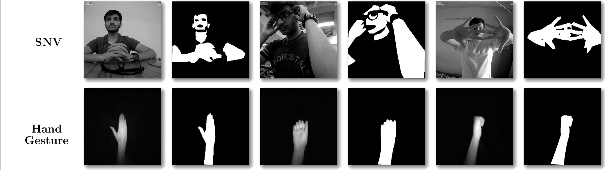
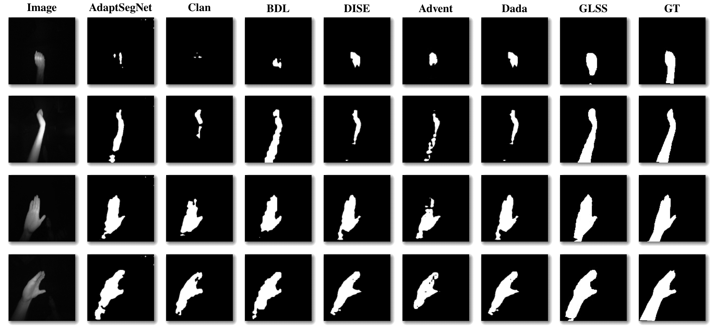

# About

SNV and Hand gesture dataset contains NIR images and corresponding masks which can be used for the task of Unsupervised domain adaptation for the task of skin segmentation. 

# Paper
'Unsupervised Domain Adaptation for Semantic Segmentation of NIR Images through Generative Latent Search'
Accepted in ECCV2020 (Spotlight). 
Preprint: https://arxiv.org/abs/2006.08696

[Code](https://github.com/ambekarsameer96/GLSS) | [Introduction Video](https://youtu.be/t4jIz2JvUjY)


# Dataset Details 

We create and use two NIR datasets (publicly available) as targets. The first one named as the Skin NIR Vision (SNV), consists of 800
images of multiple human subjects taken in different scenes, captured using a WANSVIEW 720P camera in the night-vision mode. The captured images cover
wide range of scenarios for skin detection task like presence of multiple humans, backgrounds similar to skin color, different illuminations, saturation levels and different postures of subjects to ensure diversity. Additionally, we made use of the publicly available multi-modal Hand Gesture dataset1 as another target dataset which we call as Hand Gesture dataset. This dataset covers 16 different handposes of multiple subjects. We randomly sampled 500 images in order to cover
illumination changes and diversity in hand poses. Both SNV and Hand Gesture datasets are manually annotated with precision.


*Figure1: Examples of Images and corresponding masks*


Figure 2: *Qualitative comparison of predicted segmentation skin masks on Hand Gesture datasets with standard UDA methods. Top four rows shows skin masks for SNV dataset and the last four are the masks for Hand Gesture dataset. It is evident that GLSS predicted masks are very close to the GT masks as compared to other UDA methods. (SO=Source Only, ASN=AdaptSegNet, GT=Ground Truth)*

[Download Dataset](http://forms.gle/y5vPeyT6zi9gdqD57)
Kindly cite our datsaet if you use it. 

# Cite

[Preprint](https://arxiv.org/abs/2006.08696)

```
@article{pandey2020skin,
  title={Skin Segmentation from NIR Images using Unsupervised Domain Adaptation through Generative Latent Search},
  author={Pandey, Prashant and Tyagi, Aayush Kumar and Ambekar, Sameer and AP, Prathosh},
  journal={arXiv preprint arXiv:2006.08696},
  year={2020}
}
```

